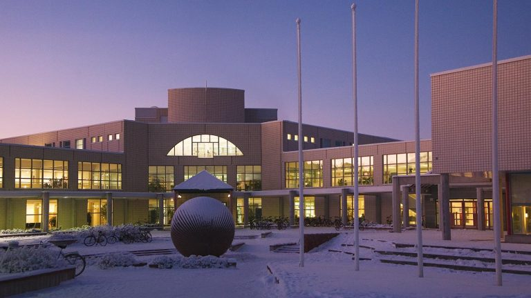

# University Of Oulu IT Enrollment

Welcome to the University IT Enrollment page! This page provides information for prospective students interested in enrolling in IT programs.

## Programs Offered

| Program Name                                  | Degree Level    | Duration   |
|-----------------------------------------------|-----------------|------------|
| Bachelor of Science in Information Technology | Bachelor's      |  4 years   |
| Master of Science in Information Systems      | Master's        |  2 years   |
| Bachelor of Software Engineering Technology   | Certificate     |  6 months  |

  ## Why Choose Us?

  - **Experienced Faculty**: Our faculty members have years of industry experience.
  - **State-of-the-art Facilities**: Access to modern labs and equipment.
  - **Flexible Learning Options**: Full-time, part-time and online courses available.
 
    ## Enrollment Process

    To enroll in any of our programs, follow these steps:

    1. Visit our [Enrollment Page](#) to fill out the application.
    2. Submit your academic transcripts.
    3. Pay the application fee.
    4. Await confirmation of your enrollment.

    ## Tasks

    Here are some tasks to consider for the enrollment process:

    - [x]  Create a detailed enrollment brochure.
    - [x]  Set up a virtual information session.
    - [x]  Update the website with applicaion deadlines.
    - [ ]  Gather testimonials from recent graduates.
    - [ ]  Monitor social media for student inquiries.

    ## Contact Us

    For more information, Please reach out:

    - **Email**: university.of.oulu@oulu.fi
    - **Phone**: +358 29448 0000
   
    

    ## Testimonials

    > "The IT program provided me with the skills to excel in my career!"
    > - **John Doe,Alumnus**

    ## Frequently Asked Questions

    - **What are the admission requirements?**
    -  **Can I apply for financial aid?**
    -  **Is there a part-time option available?**
